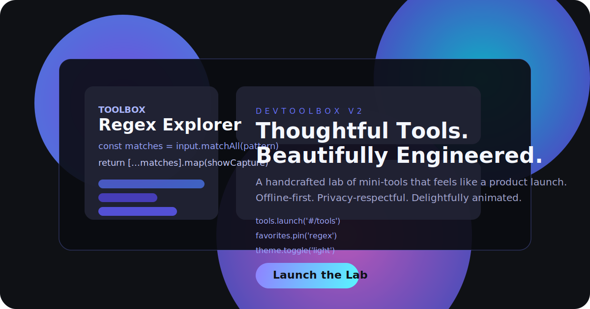

# DevToolbox — A Developer’s Personal Lab

> Thoughtful Tools. Beautifully Engineered.

DevToolbox is a static, offline-friendly toolbox that treats engineering craft as a design discipline. Fourteen micro-apps share a cohesive shell, unified interactions, and documented intent. Every module runs locally — no telemetry, no server calls.



## Live Demo

Host the repository on GitHub Pages or any static host. The entry point is [`index.html`](./index.html); all routes use the hash-based router, so deep links like `#/tools/regex` work instantly.

## Tools

| Tool | Description |
| --- | --- |
| Regex Explorer | Highlight matches and understand capture groups. |
| JSON Doctor | Validate and prettify JSON payloads. |
| JWT Lens | Decode tokens securely, offline. |
| Base64 Studio | Encode/decode text with UTF-8 awareness. |
| UUID Generator | Stream cryptographically-strong UUIDs. |
| Hash Forge | Hash messages with Web Crypto. |
| Cron Poet | Translate crons into human phrasing. |
| Time Atlas | Compare dates and zones. |
| HTTP Whisperer | Search status codes with guidance. |
| SQL Formatter | Beautify SQL with keyword casing. |
| Diff Canvas | Visualize line-level changes. |
| Markdown Renderer | Preview Markdown with elegant typography. |
| JSON Schema Validator | Check payloads against schemas. |
| Contrast Lab | Evaluate color accessibility. |

## Architecture

- **Vanilla ES Modules** — Router, state, and tools are modular and lazy-loaded.
- **Tailwind + custom CSS** — Styles via CDN plus handcrafted variables/animations.
- **Service Worker** — Caches the shell for offline re-visits.
- **Utilities** — Shared helpers for storage, strings, dates, and color math.

```
js/
├── app.js           # bootstraps router + shortcuts
├── router.js        # hash router with lazy modules
├── state.js         # tool metadata + persisted favorites
├── tools/           # individual tool modules
└── pages/           # home, tools hub, and case study
```

## UX & Accessibility

- Dark theme by default with light mode toggle.
- Keyboard shortcuts: `/` search, `Cmd/Ctrl + Enter` run, `Esc` clear, `g t` tools, `g s` study.
- Copy toasts, glow pulses, and gentle tilts add feedback without distraction.
- WCAG AA contrast targets; focus states glow and remain visible.

## Adding a Tool

1. Create a module in `js/tools/<slug>.js` that exports a default render function.
2. Use `toolPage(tool, { workspace, output, actions, notes })` to keep layout consistent.
3. Register metadata in [`js/state.js`](./js/state.js).
4. Include any local data/examples under `data/` if necessary.

## Privacy & Security

- No analytics scripts or external requests after initial load.
- Tools like JWT Lens and JSON Doctor never send pasted data anywhere.
- Service worker uses a small cache and respects the same-origin policy.

## License

MIT © Dominic Minischetti
